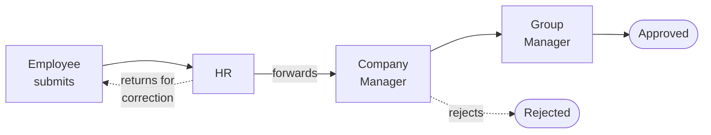
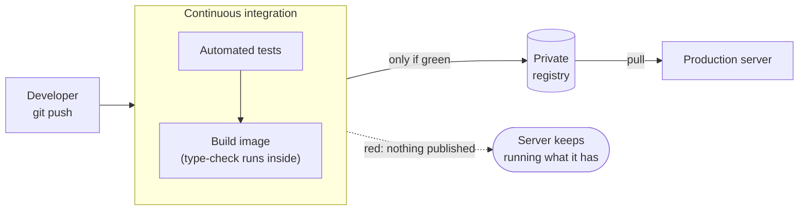

# RUM Group HR System

A self-hosted HR platform running in production for a multi-company group in the
UAE. Two portals, one codebase: staff administrators manage the organisation,
and employees serve themselves — with managers gaining their powers from where
they sit in the org chart rather than from a permissions screen.

**This repository is an overview, not the source.** No application code, no data,
no configuration. It exists to describe how the system is built and why, for
people evaluating the work.

---

## The problem

A group of companies tracked its people in spreadsheets: one for employees, one
for company licences, one for vehicles, several for leave. Passports, visas,
labour cards and Emirates IDs expire on dates nobody was watching, and in the UAE
an expired residence visa is not a paperwork problem — it is a legal one, with
fines that accrue daily.

The system replaces the spreadsheets, and more importantly replaces the *hope*
that somebody notices an expiry in time.

---

## What it does

| Area | Capability |
|---|---|
| **Employees** | Profiles, photos, departments and positions, and a reporting hierarchy derived automatically from the org structure rather than maintained by hand |
| **Documents** | Passports, Emirates IDs, visas, labour cards and licences, with expiry tracking and a review queue |
| **Document intake** | Uploads are read by a vision model — number, dates and holder name are extracted and pre-filled for a human to confirm; the holder's face is cropped from the ID to become their profile photo |
| **Requests** | Leave, permission, overtime, business trips, working from home, shift changes and attendance corrections, each with an approval chain, follow-up conversation, withdrawal and edit-and-resend |
| **Leave** | Annual balance with carry-forward and a cap, combined sick leave, an adjustment ledger, and late-hours tracking |
| **Company assets** | Company documents with versioning and audience targeting, plus vehicles and their registration, insurance and permits |
| **Bulk import** | Employees from Excel; documents in bulk with automatic matching to the right employee or vehicle |
| **Expiry reminders** | A scheduled job that escalates as a date approaches — 30, 14, 7, 5, 3, 1 and 0 days |
| **Everything else** | Announcements with read receipts, an audit log, notifications, and a full Arabic / Urdu interface with right-to-left layout |

---

## Architecture

The application runs from a container image. The server never compiles anything
and holds no source code — it downloads a finished, tested build.

**The database is managed, and not for scale.** It holds well under a megabyte
of records. It is managed because a provider that takes automatic backups and can
restore to a point in time is worth more than any amount of tuning — the records
in it are people's visas and salaries, and the realistic disaster is losing them,
not running out of throughput.

---

## Who uses it

Permissions are **derived from the organisation**, not assigned in a settings
screen. An employee who heads the HR department has HR powers because of where
they sit; move them and the powers move with them.

| Role | Scope | What they can do |
|---|---|---|
| Agency administrator | All companies | Full administration, user management, override any approval |
| Group Manager | Whole group | Final approval, group-wide visibility; sits above the companies |
| Company Manager | One company | Approvals and management within their company |
| HR | Whole group | Document review, employee records, bulk import, approvals |
| Employee | Themselves | Requests, own documents, leave balance, profile |

Company scoping is enforced in the backend on every query, not in the interface.
A company-scoped user cannot see another company's people even by editing a URL.

---

## The approval engine

Every approvable thing in the system — an employee request, an employee document,
a company document, a vehicle document — runs through **one sequential engine**
rather than four parallel implementations.

The parts that took the thinking:

- **One actionable approver at a time.** Someone three stages ahead cannot
  approve early and skip the people before them.
- **HR forwards, HR does not reject.** Enforced in the engine, not just hidden in
  the interface — the API refuses it too.
- **Absence is handled.** A manager on leave is skipped and the skip recorded. If
  every Group Manager is away, final approval delegates to a nominated Company
  Manager. Working from home does not count as away.
- **Nothing strands.** A chain with no possible approver — a company with no HR
  person and no configured manager — completes on start rather than sitting in a
  queue forever.
- **Returned means returned.** A request sent back has no active stage, so it
  cannot be approved by anyone until the employee resubmits it.

---

## How changes reach production

A failing test does not produce a broken deployment — it produces **no image at
all**, so there is nothing for the server to pull. Every build is also tagged
with its commit, which makes a rollback a download of something that already
exists rather than a rebuild under pressure.

---

## Reliability

The things that would actually hurt, and what handles them:

| Risk | Mitigation |
|---|---|
| A visa expiry is missed | Scheduled reminders at seven thresholds, to HR and the group's managers |
| A reminder silently fails | A reminder is recorded as sent **only** after a send succeeds; failures retry rather than being marked delivered |
| A confirmation link is burned by a mail scanner | Email confirmation activates on a form submission, never on opening the link — corporate scanners fetch every URL in an incoming message |
| The database is lost | Managed backups with point-in-time restore, plus an independent nightly dump held outside the hosting account |
| The uploaded documents are lost | They live on disk, outside any database backup, so they get their own nightly copy — the failure mode nobody notices until a restore |
| A bad deploy | Every commit stays in the registry under its own tag; rollback takes seconds |

---

## Engineering decisions worth explaining

**One implementation per feature, adapted by role.** The document review queue,
the request queue and the bulk import each exist once and are mounted by both
portals. A dual-authentication actor object resolves either a staff user or a
portal employee into one shape, so endpoints serve both without duplicate routes.
Forking a page per audience is how permission rules quietly diverge.

**Timestamps stay text.** Converting to timezone-aware column types would have
touched every serializer and comparison in the codebase for no behavioural gain.
The port to PostgreSQL deliberately left them alone.

**Additive database changes only.** Schema and migrations are idempotent and run
at start-up; there is no migration framework and no down-migrations.

**Translation coverage is checked mechanically.** Text reaches the screen by four
routes, and auditing only the obvious one reports a falsely high number. A missing
translation fails silently, and only in Arabic or Urdu.

**Start-up is serialised across workers.** Four processes import the application
at once; anything that touches the schema or seeds a row outside a shared lock
will deadlock or collide on a fresh database. Found on the first boot of the
production database, reproduced with four processes, fixed, and covered.

---

## By the numbers

| | |
|---|---|
| Backend | ~14,800 lines of Python · 32 API modules |
| Frontend | ~20,900 lines of TypeScript / React |
| Database | 35 tables |
| Tests | 51 cases, run on every push before anything can ship |
| Languages | English, Arabic, Urdu — with right-to-left layout |
| Portals | 2, sharing one codebase |
| Running cost | Under $30/month |

---

## Not included here

The application source, the deployment configuration, any employee data, and the
address of the running system. This repository describes the shape of the work;
it is not a way to run it.
