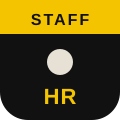
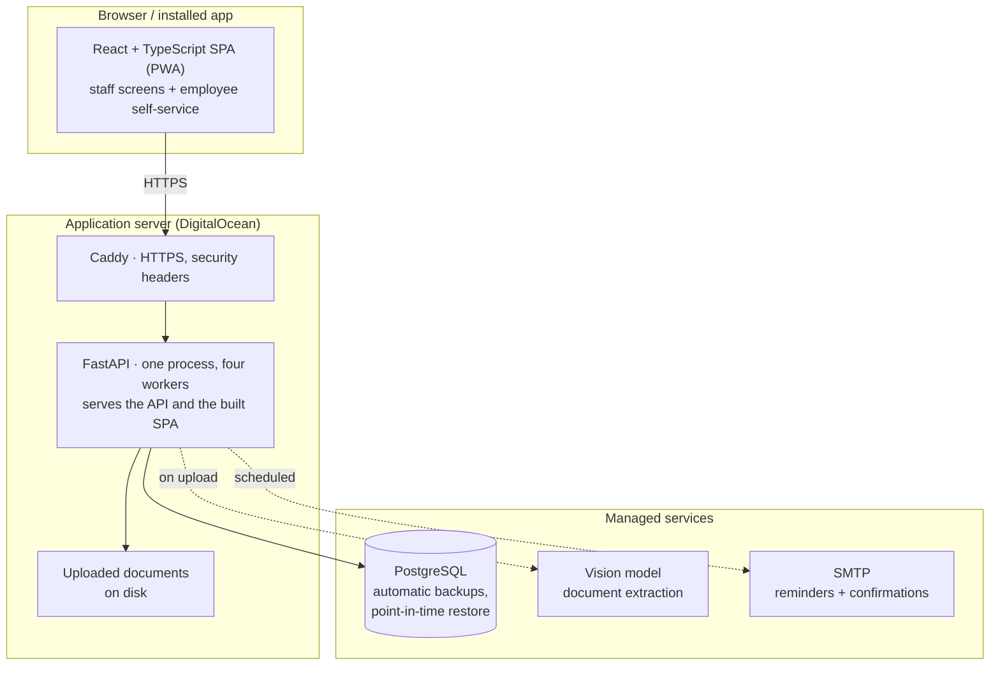
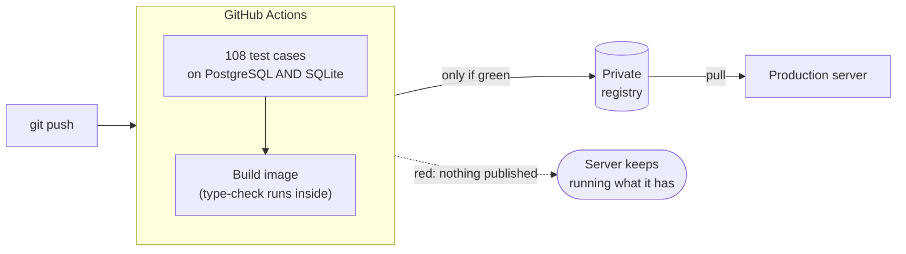

  

<h1 align="center">RUM HR</h1>

  A self-hosted HR platform running in production for a group of companies in the UAE:
  employee records, documents, requests and leave in one system — with AI that reads the paperwork.

  
  
  
  
  
  

> This is a **showcase** repository. The source code, configuration, data and the address of
> the running system are private; this page describes what it does and how it is built.

---

## The problem

The group tracked its people in spreadsheets: one for employees, one for company licences,
one for vehicles, several for leave. Passports, visas, labour cards and Emirates IDs expire on
dates nobody was watching — and in the UAE an expired residence visa is not a paperwork
problem, it is a legal one, with fines that accrue daily.

RUM HR replaces the spreadsheets, and more importantly replaces the *hope* that somebody
notices an expiry in time.

## Features

**Documents, read by AI**
- **AI document reading** — upload an Emirates ID, passport, visa, labour card or licence
  and a vision model extracts the number, dates and holder name, pre-filled for a person to
  confirm. The holder's face is cropped from the ID to become their profile photo.
- **Expiry warnings** — a reminder job flags documents as their dates approach, at 30, 14,
  7, 5, 3, 1 and 0 days out, and expiring documents surface on the dashboard and in the
  review queue.
- **Review & approval queue** — employee, company and vehicle documents all go through one
  sequential approval workflow.
- **Nothing is lost on replace** — uploading a new version archives the old one
  automatically, for employee, company and vehicle documents alike.
- **Bulk import** — employees from Excel; documents in bulk, matched to the right person or
  vehicle automatically.

**Requests & leave**
- **Employee requests** — leave, permission, overtime, business trips, working from home,
  shift changes and attendance corrections, each with an approval chain, escalation, a
  follow-up conversation, withdrawal and edit-and-resend.
- **Leave** — annual balance with carry-forward (capped at 60 days), combined sick leave
  (21 days a year), an adjustment ledger and late-hours tracking.
- **Shared calendar** — recurring off-days and dated official holidays.

**The organisation**
- **Multi-company** — every company in the group managed from one system, with company
  scoping enforced in the backend on every query.
- **Org chart that drives permissions** — the reporting hierarchy is derived from the
  organisation, and an employee who heads HR gets HR powers because of where they sit.
- **Company assets** — company documents with versioning and audience targeting, plus
  vehicles with their registration, insurance and permits.
- **Announcements** with read receipts, notifications and a full audit log.
- **English, Arabic and Urdu** with right-to-left layout, installable on phones as an app.

## Architecture

The application ships as a container image. The server never compiles anything and holds no
source code — it downloads a finished, tested build.

**The database is managed for safety, not scale.** It holds well under a megabyte of records,
but those records are people's visas and salaries. A provider that takes automatic backups and
restores to a point in time is worth more than any amount of tuning.

## Who uses it

Permissions are **derived from the organisation**, not assigned in a settings screen — move a
person and their powers move with them.

| Role | Scope | What they can do |
|---|---|---|
| Administrator | All companies | Full administration, user management, override any approval |
| Group Manager | Whole group | Final approval and group-wide visibility |
| Company Manager | One company | Approvals and management within their company |
| HR | Whole group | Document review, employee records, bulk import, approvals |
| Employee | Themselves | Requests, own documents, leave balance, profile |

A company-scoped user cannot see another company's people, even by editing a URL.

## The approval engine

Every approvable thing — an employee request, an employee document, a company document, a
vehicle document — runs through **one sequential engine** rather than four implementations.

- **One actionable approver at a time** — nobody three stages ahead can approve early.
- **HR forwards, HR does not reject** — enforced by the API, not just hidden in the interface.
- **Absence is handled** — a manager on leave is skipped and the skip recorded; if every Group
  Manager is away, final approval delegates to a nominated Company Manager.
- **Nothing strands** — a chain with no possible approver completes instead of sitting in a
  queue forever.
- **Returned means returned** — a request sent back can't be approved until it is resubmitted.

## How changes reach production

A failing test doesn't produce a broken deployment — it produces **no image at all**. Every
build is tagged with its commit, so a rollback is a download of something that already
exists, not a rebuild under pressure.

## Reliability

| Risk | Mitigation |
|---|---|
| A visa expiry is missed | A reminder job at seven thresholds, plus expiring documents on the dashboard |
| A reminder silently fails | Recorded as sent **only** after the send succeeds; failures retry |
| A confirmation link is burned by a mail scanner | Confirmation activates on a form submission, never on opening the link |
| The database is lost | Managed backups with point-in-time restore, plus an independent nightly dump |
| Uploaded documents are lost | They live on disk, outside any database backup, so they get their own nightly copy |
| A bad deploy | Every commit stays in the registry under its own tag; rollback takes seconds |

## Engineering notes

- **One implementation per feature, adapted by role.** The review queue, request queue and bulk
  import each exist once; a single actor object resolves either a staff user or an employee,
  so endpoints serve both without duplicate routes. Forked pages are how permission rules
  quietly diverge.
- **Additive, idempotent schema changes** run at start-up — no migration framework, no
  down-migrations.
- **Start-up is serialised across workers.** Four processes import the app at once; anything
  touching the schema outside a shared lock collides on a fresh database. Found on the first
  boot of the production database, reproduced, fixed and covered by a test.
- **Translation coverage is checked mechanically**, because a missing translation fails
  silently — and only in Arabic or Urdu.

## Tech stack

| Layer | Technology |
| --- | --- |
| Backend | Python, FastAPI |
| Frontend | React, TypeScript, Vite (installable PWA) |
| Database | PostgreSQL (managed) · SQLite for local and rollback |
| AI | Vision model for document extraction |
| Delivery | Docker, GitHub Actions, GitHub Container Registry |
| Hosting | DigitalOcean, Caddy (HTTPS) |

## By the numbers

| | |
|---|---|
| Backend | ~19,800 lines of Python · 34 API modules |
| Frontend | ~23,100 lines of TypeScript / React |
| Database | 38 tables |
| Tests | 108 cases, run on two database engines before anything ships |
| Languages | English, Arabic, Urdu — with right-to-left layout |

---

  Built by <a href="https://github.com/ahmaadmohdd">Ahmad Hammoudeh</a> ·
  <a href="https://www.linkedin.com/in/ahmad-hammoudeh-02471624b/">LinkedIn</a> ·
  <a href="mailto:ahmadmohd04@outlook.com">ahmadmohd04@outlook.com</a>

